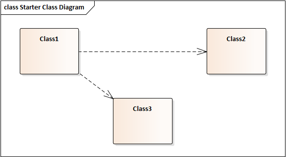
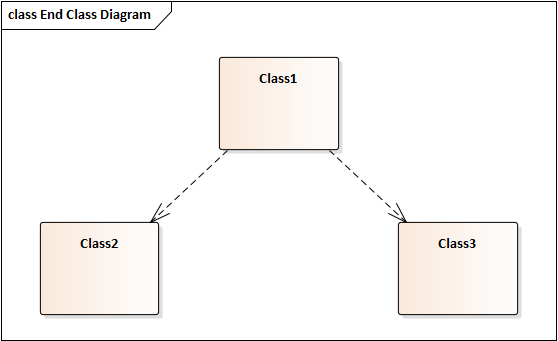
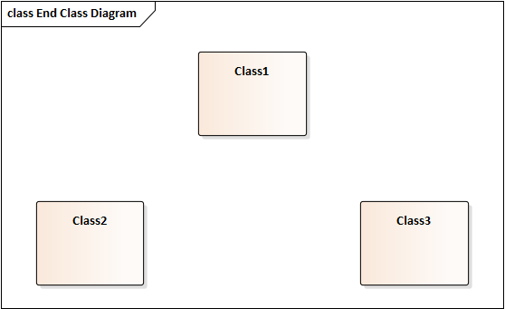
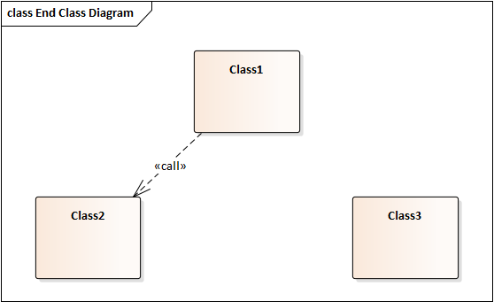
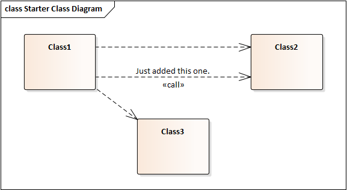
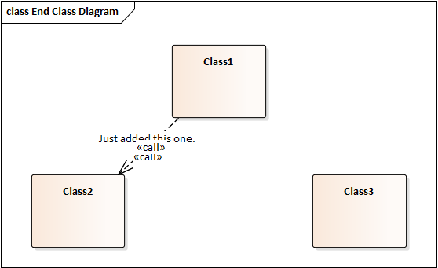

# NOTE
As of version 15.1 of Enterprise Architect, SPARX have created a better feature that can "Freeze Visible Relationships at a Point in Time", please see https://sparxsystems.com/products/ea/15.1/index.html

# Enterprise Architect Scripts
A collection of scripts that we have found helpful when using enterprise architect.

This consists of:

## Removing Annoying Connector scripts

So you want to model a set of scenarios using EA with connectors or links between different elements (e.g. Dependency, Trace etc). Then you want to model another scenario using the same elements and..... Oh no, EA keeps on adding the relationships across all of these diagrams and now I have a real maintenance headache trying to keep all of the diagrams clean. These scripts may help: 

### The scripts explained

Let's say that you want to add a diagram with some relationships between classes:

And now you want to add another diagram displaying the same classes again, Now EA adds the existing connectors to the new diagram:

Now, you might desire this behaviour and you might not... I find that this behaviour is ok until you are modelling different scenarios where you want to highlight different relationships between the same elements on different diagrams.

#### Remove_All_Connectors.js

This is a Javascript file that should be added to EA Project Browser Group script. It removes all connectors on a diagram as if the user had clicked on each connector in turn and selected "Hide Connector". The connector still remains in the model but is no longer visible on the diagram on which this script was run. Here is the result of running it on the above diagram.

#### Freeze_Connectors.js

This is a Javascript file that should be added to EA Project Browser Group script. It takes a snapshot of all of the connectors currently visible on a diagram. So let's say that having removed relationships from the "End Class Diagram" above, we now add another:

Now, running the "Freeze_Connectors.js" script, the current set of relationships are frozen so that it it easy to clean this diagram up in the future. 

#### Remove_Unfrozen_Connectors.js

This is a Javascript file that should be added to EA Project Browser Group script. It hides all of the connectors that have not been "Frozen".

So, let's say that after we've frozen the above diagram's links, other relationships are added to the first diagram:

Now, this new relationship on the first diagram infects the other diagram:

Fear Not! - Since you have frozen the state of the diagram previously, you can run "Remove_Unfrozen_Connectors.js" and the diagram will return to the state you desired:

If you need some help understanding how to install the above scripts, take a look here: https://sparxsystems.com/enterprise_architect_user_guide/14.0/automation/automation_interface.html
